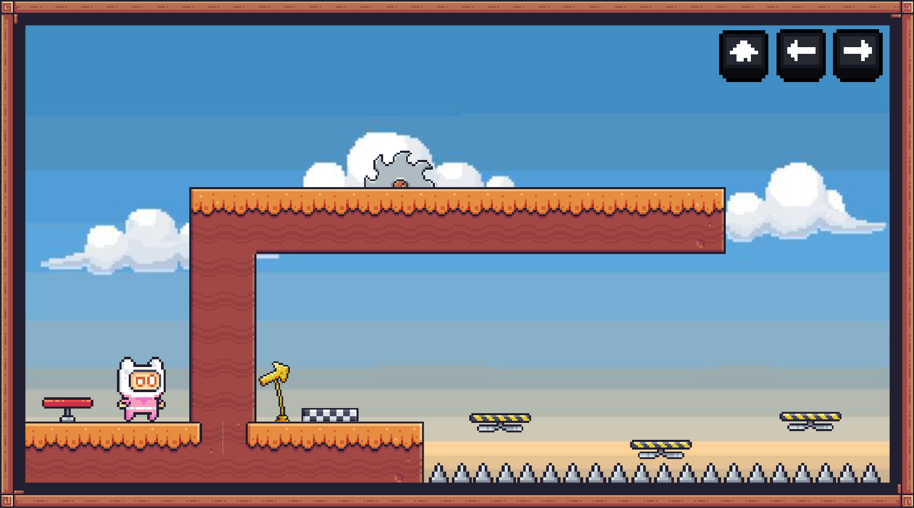

# 🎮 Over_The_Clouds

[](https://unity.com/)

Um **jogo de plataforma 2D** desenvolvido em **Unity**, com o objetivo de **superar obstáculos** e **chegar ao final da fase sem morrer**.

Com um visual em **pixel art**, o jogo desafia sua habilidade de movimento e precisão em um ambiente divertido e retrô!


## 📸 Prévia

 


## 🎯 Objetivo

- Ultrapassar todos os obstáculos do cenário
- Evitar cair ou colidir em armadilhas
- Chegar até a plataforma final sem morrer


## 🕹️ Controles

| Tecla | Ação |
|:-----:|:----:|
| ➡️ ou `D` | Mover para a direita |
| ⬅️ ou `A` | Mover para a esquerda |
| ⬆️ ou `Space` | Pular |


## 🛠️ Tecnologias Utilizadas

- [Unity Engine](https://unity.com/)
- [Sprites em Pixel Art](https://pixelfrog-assets.itch.io/pixel-adventure-1)


## 🚀 Como Rodar o Projeto

1. Clone o repositório:
   ```bash
   git clone https://github.com/SofiaAraki/Over_The_Clouds.git
   ```

2. Abra a pasta no **Unity** (versão recomendada: **2022.x** ou superior).

3. Clique em **Play** para testar o jogo!


## 📈 Roadmap - Melhorias Futuras

- [ ] Implementar múltiplas fases com dificuldade crescente
- [ ] Adicionar sistema de checkpoint
- [ ] Criar inimigos móveis
- [ ] Sistema de coleta de itens (frutas, moedas)
- [ ] Menu inicial e tela de Game Over
- [ ] Sons de pulo, colisão e vitória
- [ ] Animações de personagem
- [ ] Ajustar física para pulos mais dinâmicos


## 🤝 Contribuindo

Contribuições são muito bem-vindas!  
Se você tiver ideias para novos obstáculos, mecânicas ou melhorias, sinta-se livre para abrir um pull request ou issue 🚀
